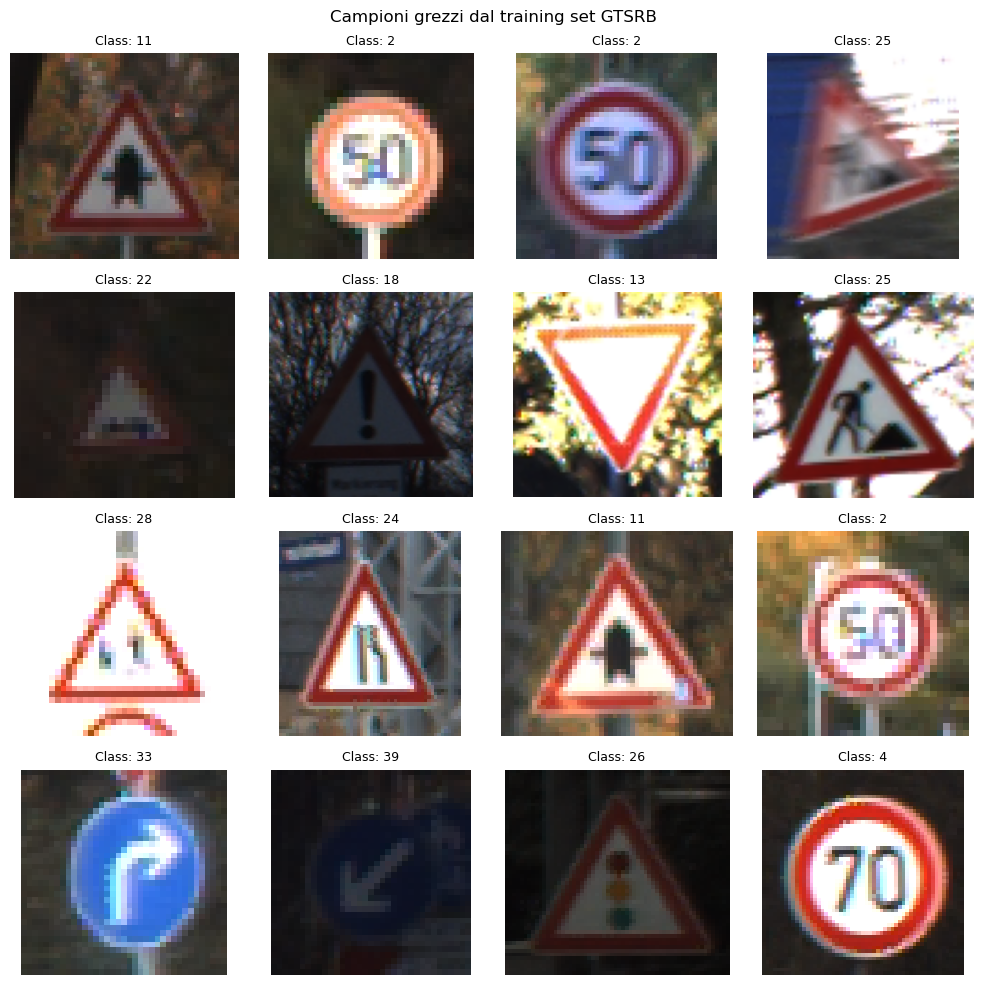
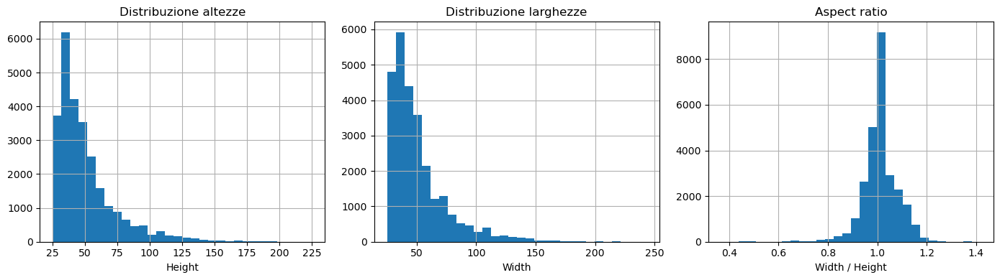
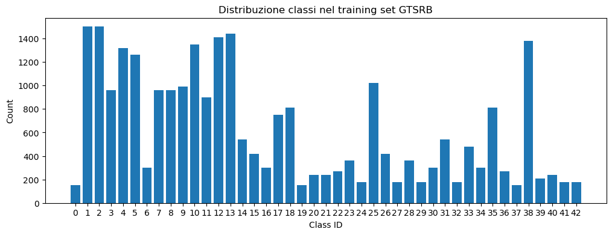
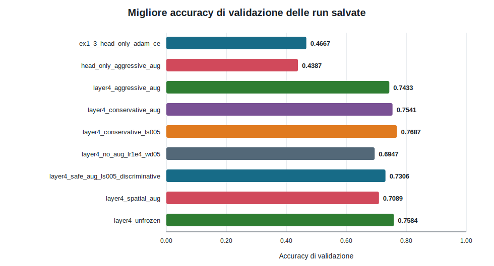
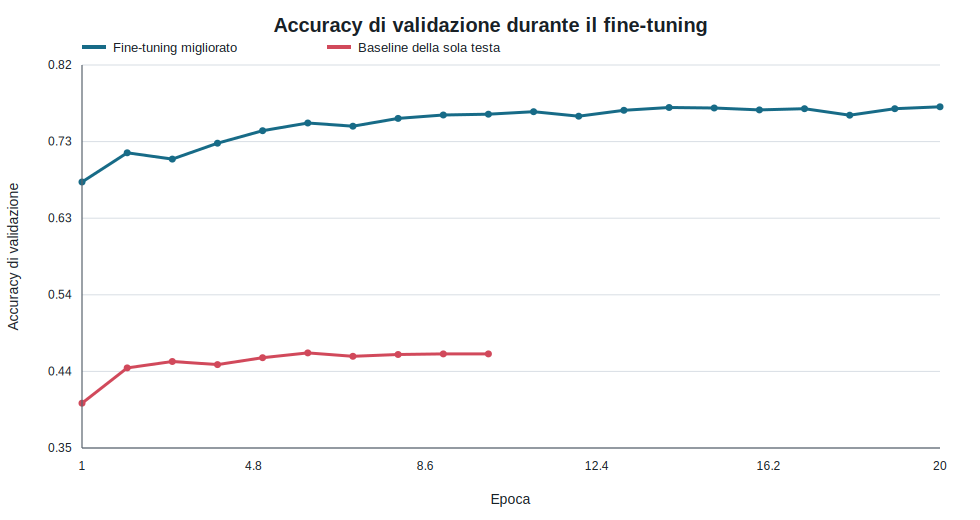
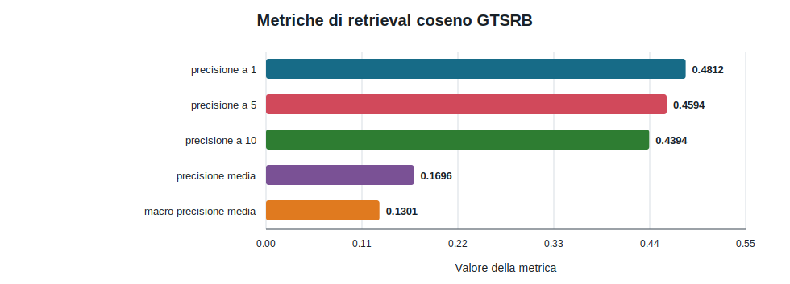

# DLA 1 — Transfer Learning e Retrieval su GTSRB

## Panoramica

Questo laboratorio studia il riconoscimento dei segnali stradali tramite due usi complementari di reti convoluzionali pre-addestrate. Il primo è la classificazione supervisionata: le feature ImageNet fisse con una SVM lineare sono confrontate con un fine-tuning di ResNet-18 progressivamente meno vincolato. Il secondo è la classificazione senza training: gli embedding pre-addestrati sono usati per il nearest-neighbour retrieval e per un Nearest-Mean Classifier (NMC).

La relazione si basa sugli output preservati nei notebook e sulle evidenze leggere in [`results/`](results/). Non ripete il training e non sostituisce gli esperimenti non riusciti con risultati ipotetici.

**Indice finale:** [`DLA_1.ipynb`](DLA_1.ipynb)

**Consegna ufficiale:** [`ASSIGNMENT.md`](ASSIGNMENT.md)

**Guida ai notebook:** [`notebooks/README.md`](notebooks/README.md)

## Obiettivi e copertura della consegna

| Requisito | Implementazione | Evidenza | Stato |
| --- | --- | --- | ---: |
| Esercizio 1.1: EDA GTSRB | Ispezione del dataset, geometria, distribuzione delle classi, esempi | [`01_eda_and_feature_baseline.ipynb`](notebooks/01_eda_and_feature_baseline.ipynb) | Completato |
| Esercizio 1.2: baseline stabile | Estrazione di feature ResNet-18 pre-addestrate + SVM lineare | Stesso notebook, accuracy di test `0.6412` | Completato |
| Esercizio 1.3: baseline di fine-tuning | Backbone congelato, nuova testa a 43 classi, validazione stratificata | [`02_finetuning_pipeline.ipynb`](notebooks/02_finetuning_pipeline.ipynb) | Completato |
| Esercizio 2: consolidamento della pipeline | Configurazione YAML, moduli riutilizzabili, artefatti, W&B facoltativo | [`02b_pipeline_consolidation.ipynb`](notebooks/02b_pipeline_consolidation.ipynb) | Completato |
| Esercizio 3.1: fine-tuning migliorato | Sblocco di `layer4`, studio di augmentation e regolarizzazione | [`03_improvements_and_retrieval.ipynb`](notebooks/03_improvements_and_retrieval.ipynb) | Completato |
| Esercizio 3.2: retrieval e NMC | Confronto delle similarità, Precision@K, mAP e centroidi di classe | [`03b_retrieval_training_free_classification.ipynb`](notebooks/03b_retrieval_training_free_classification.ipynb) | Completato |

## Fondamenti teorici

Una CNN pre-addestrata può essere usata come mappa fissa $f(x)$ oppure adattata al compito di destinazione. La baseline stabile addestra una SVM lineare sulla rappresentazione penultima di ResNet; il fine-tuning modifica invece parte della rete minimizzando la cross-entropy.

Per un batch di $N$ esempi, la loss usata dalla baseline head-only è

$$
\mathcal{L}_{\mathrm{CE}}
=
-\frac{1}{N}\sum_{i=1}^{N}\log p_{\theta}(y_i\mid x_i).
$$

$x_i$ è l'immagine, $y_i$ la classe corretta e $p_\theta(y_i\mid x_i)$ la probabilità assegnata dal modello. Penalizzare il logaritmo della probabilità corretta rende costose le predizioni sicure ma errate. La formula corrisponde a `nn.CrossEntropyLoss` costruita da `build_loss` in [`losses.py`](src/dla_lab1/losses.py) e usata da `train_model`.

Gli screening con class imbalance usano anche pesi inversi alla frequenza. Se $n_c$ è il numero di esempi della classe $c$, $C$ il numero di classi e $N=\sum_c n_c$, il codice calcola

$$
w_c=\frac{N}{C\,n_c},
\qquad
\mathcal{L}_{\mathrm{WCE}}
=
-\frac{1}{N}\sum_{i=1}^{N}w_{y_i}\log p_{\theta}(y_i\mid x_i).
$$

Le classi rare ricevono quindi un peso maggiore. Il calcolo reale è in `class_weights_from_labels` (`np.bincount`, conteggio minimo pari a uno), mentre `build_loss` passa il tensore a `nn.CrossEntropyLoss`. Il miglior modello finale usa cross-entropy con label smoothing, non la variante pesata.

Nel retrieval, query $q$ e campione di gallery $x$ sono confrontati mediante

$$
\operatorname{cos}(q,x)
=
\frac{q^\top x}{\lVert q\rVert_2\lVert x\rVert_2}.
$$

Dopo la normalizzazione $\hat q=q/\lVert q\rVert_2$ e $\hat x=x/\lVert x\rVert_2$, il valore coincide con $\hat q^\top\hat x$. Un valore vicino a uno indica direzioni simili indipendentemente dalla norma. `cosine_similarity_matrix` in [`features.py`](src/dla_lab1/features.py) applica `F.normalize` e il prodotto matriciale.

La qualità dei primi $K$ risultati è misurata da

$$
P@K
=
\frac{1}{K}\sum_{j=1}^{K}\mathbb{1}[y_{(j)}=y_q],
$$

dove $y_q$ è la classe della query, $y_{(j)}$ quella del vicino in posizione $j$ e $\mathbb{1}$ vale uno quando le etichette coincidono. `retrieval_precision_at_k` calcola prima la precisione per query e poi la media sulle query; $P@1$ verifica il solo primo vicino, mentre valori maggiori valutano una porzione più ampia del ranking.

Il Nearest-Mean Classifier comprime infine ogni classe nel centroide

$$
\mu_c=\frac{1}{N_c}\sum_{i:y_i=c}z_i,
\qquad
\hat y=\arg\max_c\operatorname{cos}(z,\mu_c).
$$

$z_i$ sono le feature della gallery e $N_c$ il loro numero per la classe $c$. `class_feature_centroids` usa la media aritmetica e `nearest_mean_classifier` sceglie il centroide con cosine similarity massima. Non viene addestrato un nuovo classificatore, ma una singola media può rappresentare male classi con più modalità visive. I dettagli operativi sono nel notebook [`03b_retrieval_training_free_classification.ipynb`](notebooks/03b_retrieval_training_free_classification.ipynb).

## Dataset e analisi esplorativa

Il dataset Torchvision eseguito conteneva `26,640` immagini di training e `12,630` di test, distribuite in `43` classi. Queste sono le dimensioni osservate dal codice consegnato e quindi usate nella relazione. Le numerosità delle classi di training variavano da `150` a `1,500`, con rapporto 10:1. La larghezza variava da `25` a `243` pixel e l'altezza da `25` a `225`; entrambe le medie erano di circa `50` pixel. Valori completi e provenienza sono in [`dataset_summary.json`](results/dataset_summary.json).

### Esempi grezzi



I campioni confermano una notevole variabilità di scala, illuminazione, inquadratura e aspetto del segnale. Ciò giustifica il ridimensionamento a una forma tensoriale fissa e l'uso prudente dell'augmentation: trasformazioni che cambiano la geometria o la semantica dei colori del segnale possono compromettere l'etichetta.

### Geometria delle immagini



Dimensioni native e rapporti d'aspetto sono eterogenei. La pipeline ridimensiona le immagini a `64 × 64`, rendendo possibile il batching ma introducendo un'approssimazione geometrica. È un compromesso pratico per la GPU disponibile, non l'affermazione che la risoluzione nativa sia irrilevante.

### Sbilanciamento delle classi



Lo sbilanciamento implica che l'accuracy aggregata possa nascondere una recall debole sulle classi minoritarie. La stratificazione conserva tutte le classi in training e validazione; lo split della baseline conteneva `20,820` campioni di training e `5,820` di validazione, senza classi mancanti. Cross-entropy pesata e focal loss sono state incluse nel registro degli esperimenti, anche se il miglior risultato finale è derivato dal fine-tuning selettivo con label smoothing e non da una run con loss pesata.

## Preprocessing e baseline stabile

Le immagini sono ridimensionate a `64 × 64`, convertite in tensori e normalizzate secondo la convenzione del backbone pre-addestrato. Una ResNet-18 con pesi ImageNet predefiniti viene convertita in estrattore di feature rimuovendo il classificatore finale. Gli embedding fissi risultanti alimentano una `sklearn.svm.SVC` lineare con `C=1.0`.

| Parametro | Valore | Verificato in |
| --- | ---: | --- |
| Backbone | ResNet-18, pesi pre-addestrati predefiniti | `config/config.yaml` |
| Dimensione dell'input | 64 × 64 | `config/config.yaml` |
| Batch size dell'estrazione | 128 | `config/config.yaml` |
| Classificatore | SVM lineare | `config/config.yaml` |
| C della SVM | 1.0 | `config/config.yaml` |
| Campioni di training | 26,640 | output del notebook della baseline |
| Campioni di test | 12,630 | output del notebook della baseline |
| Tempo di fit | 114.97 s | output del notebook della baseline |
| Accuracy di test | **0.6412** | output del notebook della baseline |

Questa baseline è stabile perché, dopo un'estrazione deterministica delle feature, viene ottimizzato soltanto il classificatore convesso. Anche il limite è chiaro: le feature ImageNet non sono adattate a piccoli segnali stradali e una superficie decisionale lineare non può recuperare informazione assente dagli embedding.

## Baseline di fine-tuning

La prima baseline neurale congela il backbone ResNet-18 e addestra soltanto una nuova testa fully connected a 43 classi. Lo split è deterministico e stratificato. Il notebook riporta soltanto `22,059` parametri addestrabili su `11,198,571` complessivi.

| Parametro | Valore |
| --- | ---: |
| Seed | 42 |
| Training / validazione | 20,820 / 5,820 |
| Layer addestrabili | Solo classificatore finale |
| Loss | Cross-entropy |
| Ottimizzatore | Adam |
| Learning rate iniziale | 1e-3 |
| Batch size | 128 |
| Epoche | 10 |
| Scheduler | Step decay |
| Migliore accuracy di validazione | 0.4667 all'epoca 6 |
| Accuracy di test | **0.5038** |

L'accuracy di training ha raggiunto `0.8274`, mentre quella di validazione è rimasta vicina a `0.4655`. La testa ha quindi adattato la rappresentazione sul training senza generalizzare a sufficienza. Questo spiega perché la baseline di fine-tuning sia risultata inferiore alla SVM: nonostante il nome, quasi nessuna feature convoluzionale è stata realmente adattata e la testa neurale non lineare non ha compensato il domain mismatch del backbone congelato.

## Consolidamento della pipeline e W&B

Il secondo esercizio separa le responsabilità in moduli di configurazione, dati, modelli, loss, training, valutazione, tracciamento e visualizzazione. Ogni run locale può salvare configurazione YAML effettiva, cronologia delle epoche e riepilogo. Le esportazioni finali leggere sono versionate in [`results/`](results/); checkpoint e cartelle complete delle run restano ignorati.

Weights & Biases (W&B) è stato usato durante lo sviluppo per confrontare accuracy di training/validazione, loss, learning rate e metadati delle run. L'integrazione è implementata in [`tracking.py`](src/dla_lab1/tracking.py). È facoltativa, disattivata per impostazione predefinita e non effettua mai un login automatico. Le directory W&B locali non sono versionate perché possono essere grandi e dipendenti dall'ambiente; la relazione usa invece evidenze CSV/JSON esportate.

## Fine-tuning migliorato

Lo studio dei miglioramenti sblocca `layer4` e il classificatore di ResNet-18, quindi confronta assenza di augmentation, augmentation spaziale, aggressiva e conservativa, label smoothing e learning rate discriminativi. La configurazione documentata e selezionata usa augmentation conservativa con label smoothing.

| Parametro | Configurazione migliorata |
| --- | ---: |
| Layer addestrabili | `layer4` + `fc` |
| Quota addestrabile osservata nel notebook | 75.15% |
| Loss | Cross-entropy, label smoothing 0.05 |
| Ottimizzatore | AdamW |
| Learning rate iniziale | 5e-4 |
| Weight decay | 0.02 |
| Batch size | 128 |
| Numero massimo di epoche | 20 |
| Scheduler | Step decay, fattore 0.5 ogni 5 epoche |
| Gradient clipping | 1.0 |
| AMP | Attivo quando CUDA è disponibile |
| Accuracy finale di test nel notebook | **0.8025** |

### Confronto in validazione



Lo sblocco di `layer4` ha migliorato sistematicamente l'accuracy di validazione rispetto alle varianti head-only. L'augmentation aggressiva non ha dominato quella conservativa, risultato plausibile per i segnali stradali perché forti modifiche geometriche o cromatiche possono alterare dettagli che definiscono la classe. I valori della figura provengono da [`run_validation_summary.csv`](results/run_validation_summary.csv).

### Curve di training



La run migliorata si avvicina rapidamente a un'accuracy di training perfetta, mentre la validazione si satura sotto `0.77`, mostrando un evidente divario di generalizzazione. Il label smoothing rende la loss di training non direttamente confrontabile con quella non smussata della baseline; la relazione confronta quindi l'accuracy di validazione senza affermare che la loss sia inferiore.

Esiste un'importante limitazione di provenienza: l'output di test `0.8025` preservato e le cronologie di validazione denominate esportate sono stati creati in fasi differenti del notebook sperimentale. La metrica di test rimane verificabile nel notebook, ma questa repository non afferma che ogni riga esportata della validazione sia stata valutata sul test set. Nessun risultato è stato ricalcolato per eliminare questa discrepanza.

### Confronto finale di classificazione


Il modello migliorato guadagna `0.1613` di accuracy assoluta rispetto alla SVM e `0.2987` rispetto alla baseline head-only. Il risultato negativo head-only resta nella relazione perché motiva lo sblocco selettivo. Fonte: [`test_metrics.csv`](results/test_metrics.csv).

Nella run finale non è stata preservata una matrice di confusione né un file con le predizioni per campione. I notebook includono classification report per classe, ma la relazione non ricostruisce artificialmente una confusion matrix da valori aggregati di precision/recall.

## Retrieval e Nearest-Mean Classification

Lo split di training agisce da gallery (`26,640` immagini) e quello di test da insieme di query (`12,630` immagini). Per l'esercizio retrieval/NMC sono state esaminate anche feature ResNet-50. La cosine similarity è risultata leggermente migliore della distanza euclidea e nettamente migliore del dot product non normalizzato.

| Metodo | P@1 | P@5 | P@10 |
| --- | ---: | ---: | ---: |
| Cosine similarity | **0.4812** | **0.4594** | **0.4394** |
| Distanza euclidea | 0.4763 | 0.4505 | 0.4308 |
| Dot product | 0.3611 | 0.3465 | 0.3375 |

Ulteriori risultati osservati sono mAP `0.1696`, macro class mAP `0.1301` e accuracy di test NMC `0.4185`.



La precision diminuisce al crescere di K perché nel ranking entrano più vicini visivamente simili ma con classe differente. NMC è più economico in inferenza perché conserva un solo centroide per classe, ma perde la struttura multimodale interna alle classi. Entrambi gli approcci di retrieval risultano inferiori al fine-tuning supervisionato; il loro valore è il riuso senza training e l'interpretabilità, non la massima accuracy di classificazione.

## Cosa ha funzionato, cosa no e perché

**Ha funzionato:** le feature pre-addestrate fisse hanno definito una baseline riproducibile; lo split stratificato ha evitato classi mancanti; lo sblocco dell'ultimo blocco residuo ha permesso l'adattamento al target; augmentation conservativa e label smoothing hanno migliorato il comportamento in validazione; la cosine similarity è risultata la migliore metrica di retrieval.

**Ha funzionato meno:** la baseline neurale head-only ha generalizzato peggio della SVM; l'augmentation aggressiva ha ridotto le prestazioni in validazione; le run senza augmentation hanno raggiunto un'accuracy di training perfetta ma un plateau di validazione molto più basso; NMC ha compresso la gallery in modo eccessivo.

**Problemi risolti:** moduli locali riutilizzabili hanno sostituito il codice ripetuto nei notebook; i percorsi sono relativi alla root del laboratorio; le celle costose sono controllate da flag; il login W&B è manuale; cronologie e metriche sono ora ispezionabili indipendentemente su GitHub.

## Limiti

- È riportato un solo seed principale; non è stata misurata la variabilità su training seed indipendenti.
- Lo split di training nativo da 26,640 immagini osservato da Torchvision costituisce la base sperimentale consegnata; non sono state unite altre distribuzioni di GTSRB.
- I limiti hardware hanno favorito input `64 × 64` e ridotto il budget sperimentale
- Log W&B grezzi e checkpoint restano locali.

## Riproducibilità

Eseguire i notebook in ordine. La consultazione rapida non richiede training. Per riaddestrare, installare i requisiti dalla root, scaricare GTSRB tramite Torchvision, impostare `RUN_TRAINING = True` soltanto nel notebook desiderato e, se necessario, abilitare W&B dopo un `wandb login` esplicito. Estrazione delle feature e valutazione finale sul test hanno flag separati per evitare ricalcoli accidentali.

Per rigenerare gli elementi grafici della relazione:

```bash
python tools/build_report_assets.py
```

Il comando legge evidenze versionate e output dei notebook; non addestra alcun modello.

## Struttura dei file

| Percorso | Scopo |
| --- | --- |
| `DLA_1.ipynb` | Indice del laboratorio leggibile su GitHub |
| `notebooks/` | Notebook finali eseguiti nell'ordine degli esercizi |
| `src/dla_lab1/` | Implementazione riutilizzabile |
| `scripts/` | Entry point per ambiente, training, estrazione e valutazione checkpoint |
| `config/config.yaml` | Registro centrale degli esperimenti e valori predefiniti |
| `results/` | Evidenze pubbliche leggere |
| `figures/` | Figure estratte o generate dalle evidenze |

## Dipendenze principali

| Libreria | Scopo | Utilizzata in |
| --- | --- | --- |
| PyTorch | Calcolo tensoriale, training, checkpoint | Fine-tuning e valutazione |
| Torchvision | GTSRB e modelli ResNet pre-addestrati | Tutti gli esperimenti di visione artificiale |
| scikit-learn | SVM, report, metriche | Baseline stabile e valutazione |
| pandas / NumPy | Tabelle, metadati, elaborazione delle evidenze | EDA e relazioni |
| Matplotlib | EDA, curve, retrieval visuale | Notebook |
| PyYAML | Configurazione degli esperimenti | Pipeline |
| Weights & Biases | Tracciamento facoltativo delle run | Consolidamento della pipeline |

## Moduli locali e funzioni principali

| Funzione/classe | File sorgente | Scopo | Input | Output | Utilizzata in |
| --- | --- | --- | --- | --- | --- |
| `build_dataloaders` | [`data.py`](src/dla_lab1/data.py) | Crea loader stratificati di training/validazione/test | Configurazione, trasformazioni, root | Loader e metadati dello split | Notebook di fine-tuning |
| `build_feature_extractor` | [`models.py`](src/dla_lab1/models.py) | Rimuove il classificatore da una ResNet pre-addestrata | Nome modello, pesi | Estrattore di feature CNN | SVM e retrieval |
| `run_finetuning` | [`experiments.py`](src/dla_lab1/experiments.py) | Esegue un esperimento registrato | Configurazione, nome esperimento, root | Modello, cronologia, metriche, artefatti | Esercizi 1.3 e 3.1 |
| `retrieval_precision_at_k` | [`features.py`](src/dla_lab1/features.py) | Calcola la concordanza delle etichette nel top-K retrieval | Similarità, etichette, K | Precision@K | Esercizio 3.2 |
| `retrieval_mean_average_precision_chunked` | [`features.py`](src/dla_lab1/features.py) | Calcola la mAP senza allocare l'intera matrice di similarità | Tensori di feature, etichette, chunk size | Metriche mAP | Esercizio 3.2 |
| `nearest_mean_classifier` | [`features.py`](src/dla_lab1/features.py) | Classifica tramite il centroide di classe più vicino | Feature ed etichette di gallery/query | Predizioni | Esercizio 3.2 |
| `save_run_artifacts` | [`tracking.py`](src/dla_lab1/tracking.py) | Salva configurazione, cronologia, riepilogo e dati di tracciamento facoltativi | Stato della run e percorso di output | File locali di evidenza | Consolidamento della pipeline |

## Uso dell'IA

L'assistenza dell'IA ha supportato interpretazione dei requisiti, debugging, organizzazione dei moduli, documentazione e revisione della provenienza dei risultati. Non ha fornito osservazioni sperimentali. Si veda [`../AI_USAGE.md`](../AI_USAGE.md).

## Fonti

- [Sito del benchmark GTSRB](https://benchmark.ini.rub.de/gtsrb_dataset.html)
- [API Torchvision GTSRB](https://docs.pytorch.org/vision/main/generated/torchvision.datasets.GTSRB.html)
- [API Torchvision ResNet](https://docs.pytorch.org/vision/stable/models/resnet.html)
- [Documentazione Scikit-learn SVC](https://scikit-learn.org/stable/modules/generated/sklearn.svm.SVC.html)
- [Documentazione Weights & Biases](https://docs.wandb.ai/)

## Conclusione

Il laboratorio mostra perché una baseline stabile su feature pre-addestrate sia un controllo utile e perché l'adattamento selettivo sia importante. Il miglior risultato, accuracy di test `0.8025`, è arrivato soltanto dopo aver sbloccato feature di alto livello e controllato augmentation e regolarizzazione. Gli esperimenti di retrieval offrono un uso differente della rappresentazione, con prestazioni inferiori ma senza training. Risultati negativi e limiti residui di provenienza restano visibili invece di essere nascosti.
