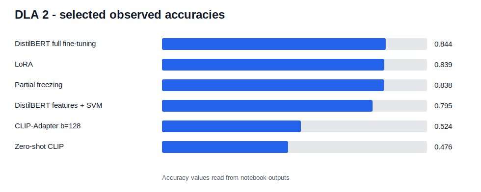

# DLA 2 - Transformers, Sentiment Analysis and CLIP

## Overview

This laboratory uses the Hugging Face ecosystem to build sentiment-analysis baselines and fine-tuned DistilBERT models. It also includes a CLIP/ImageNet-Sketch extension using a parameter-efficient adapter.

## Official assignment

- GitHub notebook: [`ASSIGNMENT.ipynb`](ASSIGNMENT.ipynb)
- Markdown copy: [`ASSIGNMENT.md`](ASSIGNMENT.md)

## Assignment coverage

| Assignment requirement | Notebook section | Status | Evidence |
| --- | --- | ---: | --- |
| Exercise 1.1 - dataset splits | `01_sentiment_dataset_tokenizer_baseline.ipynb` | Completed | Rotten Tomatoes splits loaded and inspected |
| Exercise 1.2 - DistilBERT/tokenizer | `01_sentiment_dataset_tokenizer_baseline.ipynb` | Completed | Tokenizer/model outputs inspected |
| Exercise 1.3 - stable baseline | `01_sentiment_dataset_tokenizer_baseline.ipynb` | Completed | DistilBERT CLS features + SVM, test accuracy 0.7946 |
| Exercise 2 - full fine-tuning | `02_distilbert_full_finetuning.ipynb` | Completed | Test accuracy 0.8443 |
| Exercise 3.1 - efficient fine-tuning | `03_efficient_finetuning_sentiment.ipynb` | Completed | LoRA and partial freezing compared |
| Exercise 3.2 - CLIP adaptation | `04_clip_adapter_imagenet_sketch.ipynb` | Completed | CLIP-Adapter b=128 accuracy 0.5241 |

## Results summary

| Experiment | Metric | Observed value |
| --- | --- | ---: |
| DistilBERT CLS features + SVM | Test accuracy | 0.7946 |
| Full DistilBERT fine-tuning | Test accuracy | 0.8443 |
| LoRA fine-tuning | Test accuracy | 0.8386 |
| Partial freezing | Test accuracy | 0.8377 |
| Zero-shot CLIP on ImageNet-Sketch | Accuracy | 0.4759 |
| CLIP-Adapter bottleneck=128 | Accuracy | 0.5241 |

## Main dependencies and imports

| Package/import | Purpose | Used in |
| --- | --- | --- |
| `datasets` | Rotten Tomatoes dataset loading | Sentiment analysis |
| `transformers` | DistilBERT tokenizer/model and Trainer | Feature extraction and fine-tuning |
| `peft` | LoRA configuration | Efficient fine-tuning |
| `sklearn` | SVM and classification metrics | Baseline and evaluation |
| `torch` | Tensor/model execution | All experiments |
| `open_clip` | CLIP model and preprocessing | ImageNet-Sketch extension |

## Local functions and source files

| Function/class | Defined in | Purpose | Main inputs | Main outputs | Used in |
| --- | --- | --- | --- | --- | --- |
| `load_rotten_tomatoes` | `src/dla_lab2/sentiment.py` | Load dataset splits | dataset id/cache | dataset dict | Exercise 1 |
| `extract_cls_features_with_pipeline` | `src/dla_lab2/sentiment.py` | Extract CLS embeddings | texts, model, tokenizer | feature matrix | Baseline |
| `build_training_arguments` | `src/dla_lab2/sentiment.py` | Configure Trainer | output dir, hyperparameters | TrainingArguments | Fine-tuning |
| `lora_sequence_classifier_init` | `src/dla_lab2/sentiment.py` | Build LoRA model | model id, LoRA config | PEFT model | Exercise 3.1 |
| `CLIPAdapter` | `src/dla_lab2/clip_utils.py` | Parameter-efficient adapter | CLIP features | adapted features | Exercise 3.2 |

## External sources and references

| Source | Used for | Adaptation or contribution |
| --- | --- | --- |
| Official assignment | Requirements | Converted into `ASSIGNMENT.ipynb`. |
| Hugging Face Datasets | Dataset loading | Rotten Tomatoes splits. |
| Hugging Face Transformers | DistilBERT and Trainer | Tokenization/fine-tuning pipeline. |
| Hugging Face PEFT | LoRA | Efficient fine-tuning comparison. |
| Rotten Tomatoes dataset card | Dataset description | Sentiment dataset source. |
| open_clip repository | CLIP model loading | ImageNet-Sketch experiment. |
| ImageNet-Sketch | External validation dataset | CLIP domain-shift evaluation. |
