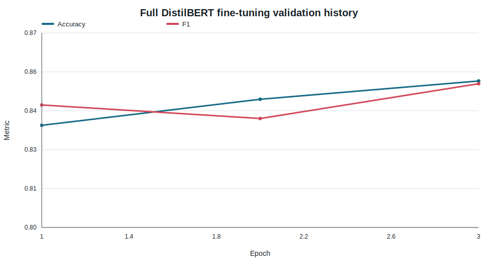
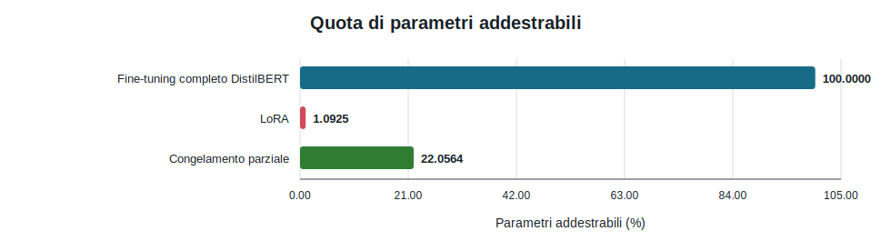
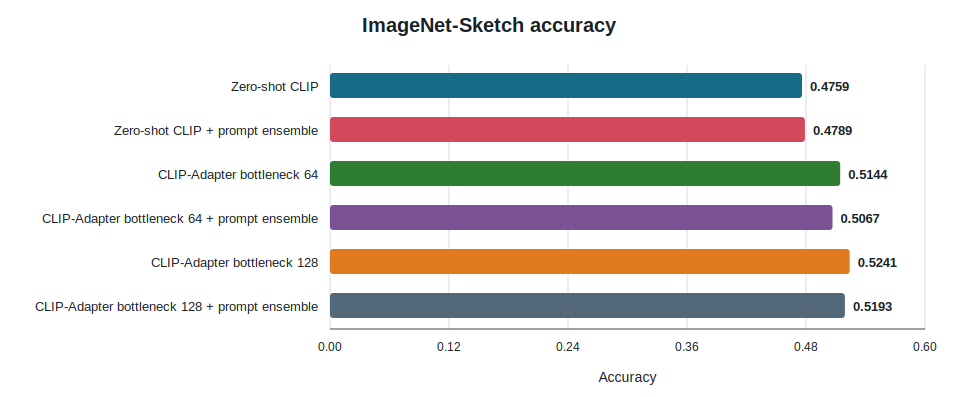
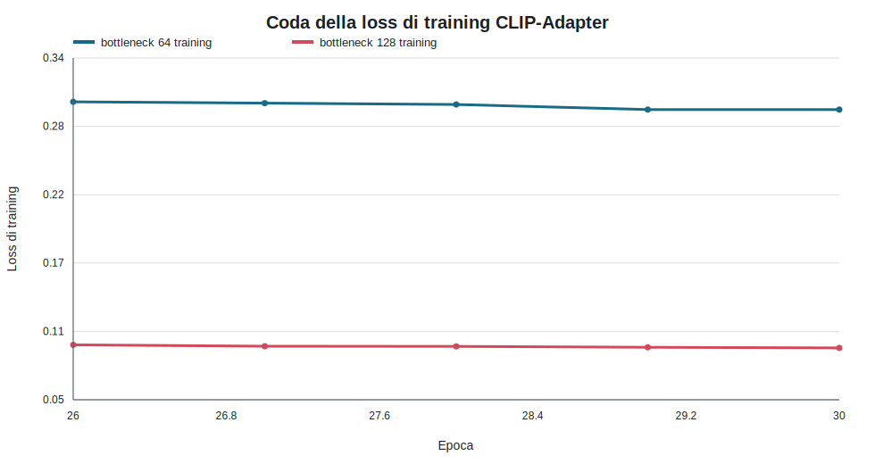

# DLA 2 — Transformer, Fine-tuning efficiente e CLIP

## Panoramica

Questo laboratorio contiene due studi distinti. Il primo esegue la classificazione binaria del sentiment su Rotten Tomatoes con DistilBERT, passando da feature congelate al fine-tuning completo e parameter-efficient. Il secondo valuta CLIP su ImageNet-Sketch e addestra un piccolo CLIP-Adapter mantenendo congelato il backbone visione-linguaggio.

I due gruppi di accuracy sono riportati separatamente perché appartengono a dataset e spazi di predizione differenti. Tutti i valori seguenti sono collegati agli output dei notebook eseguiti e replicati in [`results/`](results/).

**Indice finale:** [`DLA_2.ipynb`](DLA_2.ipynb)

**Consegna ufficiale:** [`ASSIGNMENT.md`](ASSIGNMENT.md)

**Guida ai notebook:** [`notebooks/README.md`](notebooks/README.md)

## Obiettivi e copertura della consegna

| Requisito | Implementazione | Evidenza | Stato |
| --- | --- | --- | ---: |
| Esercizio 1.1: dataset | Caricamento e ispezione degli split e degli esempi Rotten Tomatoes | [`01_sentiment_dataset_tokenizer_baseline.ipynb`](notebooks/01_sentiment_dataset_tokenizer_baseline.ipynb) | Completato |
| Esercizio 1.2: Transformer/tokenizer | Ispezione di token ID, mask, token decodificati e hidden state | Stesso notebook | Completato |
| Esercizio 1.3: baseline stabile | Feature `[CLS]` di DistilBERT + SVM lineare | Accuracy di test `0.7946` | Completato |
| Esercizio 2: fine-tuning completo | Padding dinamico, testa di sequence classification, Trainer | [`02_distilbert_full_finetuning.ipynb`](notebooks/02_distilbert_full_finetuning.ipynb) | Completato |
| Esercizio 3.1: fine-tuning efficiente | LoRA e congelamento parziale | [`03_efficient_finetuning_sentiment.ipynb`](notebooks/03_efficient_finetuning_sentiment.ipynb) | Completato |
| Esercizio 3.2: adattamento CLIP | Studio dei prompt e CLIP-Adapter su ImageNet-Sketch | [`04_clip_adapter_imagenet_sketch.ipynb`](notebooks/04_clip_adapter_imagenet_sketch.ipynb) | Completato |

## Fondamenti teorici

DistilBERT trasforma il testo tokenizzato in hidden state contestuali. `input_ids` seleziona le voci del vocabolario; `attention_mask` distingue i token reali dal padding. Il primo vettore nascosto corrisponde a `[CLS]` ed è usato come rappresentazione fissa della frase per la baseline SVM. Per la classificazione end-to-end, `AutoModelForSequenceClassification` aggiunge una testa specifica e aggiorna il backbone con cross-entropy.

LoRA mantiene congelate le matrici pre-addestrate e apprende aggiornamenti a basso rango. Questa implementazione agisce sulle proiezioni di attenzione `q_lin` e `v_lin` di DistilBERT. Il congelamento parziale è un controllo più semplice: embedding e primi quattro blocchi Transformer restano congelati, mentre i blocchi successivi e il classificatore sono ottimizzati.

CLIP allinea gli embedding di immagini e testo. La classificazione zero-shot confronta ogni immagine con prototipi testuali derivati dai prompt. CLIP-Adapter inserisce un piccolo MLP residuale sulle feature immagine congelate, consentendo l'adattamento al dominio senza aggiornare gli encoder CLIP.

## Parte I — Analisi del sentiment su Rotten Tomatoes

### Dataset

Il dataset Hugging Face contiene un campo di testo e un'etichetta binaria (`0` negativa, `1` positiva). La run consegnata ha osservato i seguenti split fissi:

| Split | Righe | Etichette |
| --- | ---: | --- |
| Training | 8,530 | 0 e 1 |
| Validazione | 1,066 | 0 e 1 |
| Test | 1,066 | 0 e 1 |

Il corpus sorgente contiene complessivamente 5,331 frasi positive e 5,331 negative. Entrambe le etichette sono presenti in ciascuno split osservato; il notebook non ha salvato una tabella separata con le numerosità per classe e per split, quindi non vengono avanzate affermazioni più granulari sul bilanciamento. Gli esempi rappresentativi sono campionati con seed `42`. Fonte: [`dataset_summary.csv`](results/dataset_summary.csv) e [scheda del dataset](https://huggingface.co/datasets/cornell-movie-review-data/rotten_tomatoes).

### Tokenizzazione e preprocessing

Il tokenizer viene caricato da `distilbert/distilbert-base-uncased`. I notebook ispezionano i token `[CLS]`, `[SEP]` e `[PAD]` decodificati, la forma di `input_ids` e `attention_mask` e lo hidden state finale di forma `(batch, sequence_length, 768)`. Il preprocessing usa una lunghezza massima di `256` e delega il padding a `DataCollatorWithPadding`, così ogni batch viene completato soltanto fino alla sequenza più lunga che contiene. Non è stata salvata una distribuzione indipendente delle lunghezze; il rischio di troncamento oltre 256 token è quindi un limite documentato, non una quantità stimata.

### Baseline stabile: DistilBERT congelato + SVM

La baseline estrae dai tre split la rappresentazione nascosta del primo token, producendo feature a 768 dimensioni, e addestra una SVM lineare. DistilBERT rimane congelato.

| Parametro | Valore |
| --- | ---: |
| Modello | `distilbert-base-uncased` |
| Feature | Ultimo hidden state al token di indice 0 (`[CLS]`) |
| Dimensione delle feature | 768 |
| Batch size | 32 |
| SVM | Lineare, C=1.0 |
| Seed | 42 |

| Split | Accuracy | F1 | Precision | Recall |
| --- | ---: | ---: | ---: | ---: |
| Validazione | 0.8180 | 0.8142 | 0.8317 | 0.7974 |
| Test | **0.7946** | 0.7908 | 0.8054 | 0.7767 |

Il calo da validazione a test è `0.0235`, quindi la baseline stabile offre un riferimento utile ma non perfettamente trasferibile. È conveniente dal punto di vista computazionale perché il costoso forward pass del Transformer può essere memorizzato e il classificatore è piccolo.

### Fine-tuning completo di DistilBERT

`AutoModelForSequenceClassification` aggiunge un pre-classifier inizializzato casualmente e una testa binaria. Hugging Face `Trainer` gestisce ottimizzazione e validazione periodica; `DataCollatorWithPadding` esegue il padding dinamico. Accuracy, F1, precision e recall sono calcolate con scikit-learn.

| Parametro | Valore |
| --- | ---: |
| Epoche | 3 |
| Batch size training / valutazione | 32 / 32 |
| Learning rate | 2e-5 |
| Weight decay | 0.01 |
| Step di warm-up | 81 su 801 step totali |
| Frequenza di valutazione / salvataggio | Una volta per epoca |
| Selezione del modello | Metrica di validazione registrata da Trainer |
| Seed | 42 |

L'accuracy di validazione è salita da `0.8368` a `0.8527`, mentre la loss di validazione ha raggiunto il minimo all'epoca 2 (`0.3577`) ed è aumentata a `0.3872` all'epoca 3. La divergenza è un lieve segnale di overfitting: il confine decisionale è migliorato in accuracy, mentre la calibrazione della confidenza è peggiorata. Il risultato finale sul test è accuracy `0.8443`, F1 `0.8428`, precision `0.8509` e recall `0.8349`.

### Fine-tuning efficiente

| Parametro | Fine-tuning completo | LoRA | Congelamento parziale |
| --- | ---: | ---: | ---: |
| Epoche | 3 | 3 | 3 |
| Learning rate | 2e-5 | 1e-3 | 2e-5 |
| Batch size | 32 | 32 | 32 |
| Weight decay | 0.01 | 0.01 | 0.01 |
| Rango / alpha / dropout LoRA | — | 8 / 16 / 0.1 | — |
| Blocchi congelati | Nessuno | Backbone, eccetto LoRA + testa | Embedding + primi 4 blocchi |
| Parametri addestrabili | 66,955,010 | 739,586 | 14,767,874 |
| Quota addestrabile | 100% | **1.09%** | 22.06% |

LoRA è il risultato di efficienza più netto: usa circa un ventesimo della quota addestrabile del congelamento parziale e circa un centesimo di quella del fine-tuning completo. La tabella misura i parametri addestrabili, non tempo di esecuzione o picco di memoria, che non sono stati registrati sistematicamente.

### Confronto quantitativo

| Metodo | Accuracy di test | F1 di test | Differenza dall'accuracy completa |
| --- | ---: | ---: | ---: |
| DistilBERT `[CLS]` + SVM | 0.7946 | 0.7908 | -0.0497 |
| Fine-tuning completo | **0.8443** | **0.8428** | — |
| LoRA | 0.8386 | 0.8349 | -0.0056 |
| Congelamento parziale | 0.8377 | 0.8348 | -0.0066 |

Il fine-tuning completo ha ottenuto l'accuracy più alta, ma il margine rispetto a LoRA è soltanto `0.0056`. Il congelamento parziale ha raggiunto un punteggio quasi uguale a LoRA aggiornando però circa venti volte più parametri. La SVM su feature fisse è nettamente più debole, segno che l'adattamento specifico dei layer contestuali è stato utile.

Nei notebook finali sul sentiment non sono stati salvati una confusion matrix o un file con le predizioni per esempio. Precision, recall e F1 sono disponibili e riportate, ma non viene ricostruita una matrice di confusione da metriche aggregate.

## Parte II — CLIP su ImageNet-Sketch

### Dataset e domain shift

ImageNet-Sketch contiene rappresentazioni disegnate a mano delle classi ImageNet. La run ha usato uno split `80/20` con `40,711` immagini di training e `10,178` di validazione esterna. Il training dell'adapter ha usato un sottoinsieme riproducibile di 5,000 immagini, suddiviso internamente in `4,500` feature di training e `500` di validazione dell'adapter. L'insieme di validazione esterno è rimasto completo.

Il compito è deliberatamente fuori dominio: CLIP osserva schizzi anziché fotografie naturali. L'accuracy su 1,000 classi non è quindi confrontabile con quella binaria di Rotten Tomatoes.

### Protocollo zero-shot

Il modello è OpenCLIP `ViT-B-16-quickgelu` con pesi OpenAI. Sono stati provati cinque template di prompt. Il miglior prompt singolo, `a hand-drawn sketch of a {}`, ha raggiunto `0.4759`; il peggiore `0.4622`. La media delle feature testuali sui cinque prompt ha prodotto `0.4789`, soltanto `+0.0029` rispetto alla baseline con prompt singolo selezionata.

### Configurazione CLIP-Adapter

| Parametro | Valore |
| --- | ---: |
| Backbone CLIP | `ViT-B-16-quickgelu`, pesi OpenAI |
| Dimensione delle feature immagine | 512 |
| Componenti congelati | Encoder CLIP di immagini e testo |
| Bottleneck dell'adapter | 64 e 128 |
| Alpha residuale | 0.6 |
| Learning rate dell'ottimizzatore | 2e-3 |
| Epoche | 30 |
| Batch del preprocessing immagini | 64 |
| Batch di training dell'adapter | 256 |
| Seed | 42 |

### Risultati CLIP

| Metodo | Accuracy | Guadagno rispetto allo zero-shot a prompt singolo |
| --- | ---: | ---: |
| CLIP zero-shot | 0.4759 | — |
| Zero-shot + ensemble di prompt | 0.4789 | +0.0029 |
| Adapter, bottleneck 64 | 0.5144 | +0.0385 |
| Adapter 64 + ensemble di prompt | 0.5067 | +0.0308 |
| Adapter, bottleneck 128 | **0.5241** | **+0.0481** |
| Adapter 128 + ensemble di prompt | 0.5193 | +0.0433 |

L'adapter da 128 unità ha ottenuto il miglior punteggio di validazione esterna. L'ensemble dei prompt ha migliorato leggermente CLIP zero-shot ma ha ridotto i punteggi di entrambi gli adapter, quindi non è stato mantenuto nella configurazione migliore.

Nelle ultime cinque epoche, la loss di training dell'adapter a 128 unità è rimasta vicina a `0.094`, mentre quella di validazione è rimasta intorno a `2.18`. Il modello a 64 unità ha mostrato lo stesso divario qualitativo. È evidenza di overfitting sui 4,500 esempi di feature usati per il training, anche se entrambi gli adapter migliorano l'accuracy top-1 esterna rispetto a CLIP zero-shot. Il risultato è utile, ma non deve essere interpretato come adattamento pienamente calibrato.

## Cosa ha funzionato, cosa no e perché

**Ha funzionato:** l'adattamento completo di DistilBERT ha migliorato le feature fisse; LoRA ha conservato quasi tutto il guadagno con pochissimi parametri addestrabili; il padding dinamico ha evitato di completare tutte le sequenze alla lunghezza massima globale; CLIP-Adapter ha migliorato l'accuracy top-1 nel dominio degli schizzi senza aggiornare CLIP.

**Ha funzionato meno:** la SVM su `[CLS]` congelato è rimasta sotto il fine-tuning; il congelamento parziale non ha offerto vantaggi di accuracy su LoRA pur avendo molti più parametri addestrabili; l'ensemble dei prompt non ha migliorato gli adapter; la loss di validazione degli adapter ha mostrato un overfitting rilevante.

**Problemi risolti:** i fallback di caricamento supportano la cache locale Hugging Face; la costruzione di Trainer e l'output Unicode/progress sono centralizzati; il preprocessing delle feature evita di ricalcolare l'encoder immagini CLIP per ogni prompt; le chiamate di training costose sono controllate nel percorso finale di consultazione rapida.

## Limiti

- I risultati usano un solo seed; l'incertezza tra run di fine-tuning non è stata stimata.
- Non sono stati salvati benchmark di tempo, VRAM, energia o latenza di inferenza; le conclusioni sull'efficienza riguardano quindi il numero di parametri.
- Le statistiche di lunghezza delle sequenze e le confusion matrix del sentiment non sono state preservate.
- CLIP ha usato solo 5,000 immagini di training e due dimensioni di bottleneck; la ricerca non è esaustiva.
- Download di dataset/modelli e checkpoint Hugging Face non sono versionati.
- I risultati ImageNet-Sketch sono misure su validazione esterna, non su un test set nascosto.

## Riproducibilità

I valori canonici sono in [`config/lab2_defaults.yaml`](config/lab2_defaults.yaml). In modalità rapida il training viene saltato e output/evidenze salvati restano disponibili per l'ispezione. La modalità completa richiede l'attivazione del flag `RUN_*` del notebook corrispondente, il download di modelli e dataset e, per tempi pratici, un ambiente con CUDA.

I notebook sul sentiment sono stati eseguiti nell'ambiente `DLA2026-transformers`, quello CLIP in `clip_lora`; il `requirements.txt` nella root unifica i pacchetti Python per la consegna. Le figure si rigenerano dalla root con `python tools/build_report_assets.py`.

## Struttura dei file

| Percorso | Scopo |
| --- | --- |
| `DLA_2.ipynb` | Indice del laboratorio leggibile su GitHub |
| `notebooks/01_*` | Dataset, tokenizer e baseline stabile del sentiment |
| `notebooks/02_*` | Fine-tuning completo di DistilBERT |
| `notebooks/03_*` | LoRA e congelamento parziale |
| `notebooks/04_*` | Studio CLIP e adapter |
| `src/dla_lab2/` | Funzioni di supporto riutilizzabili per sentiment e CLIP |
| `config/lab2_defaults.yaml` | Valori predefiniti principali degli esperimenti |
| `results/` | Evidenze numeriche versionate |
| `figures/` | Figure riproducibili della relazione |

## Dipendenze principali

| Libreria | Scopo | Utilizzata in |
| --- | --- | --- |
| PyTorch | Esecuzione e ottimizzazione dei modelli | Tutti gli esperimenti |
| Hugging Face Datasets | Caricamento e mapping dei dataset | Rotten Tomatoes e ImageNet-Sketch |
| Transformers | DistilBERT, tokenizer, Trainer, collator dinamico | Notebook sul sentiment |
| PEFT | Layer LoRA e wrapping del modello | Fine-tuning efficiente |
| scikit-learn | SVM lineare e metriche di classificazione | Baseline e valutazione |
| OpenCLIP | Modello CLIP, tokenizer, preprocessing | Esperimento ImageNet-Sketch |
| pandas / NumPy | Tabelle dei risultati e gestione delle feature | Tutti i notebook |

## Moduli locali e funzioni principali

| Funzione/classe | File sorgente | Scopo | Input | Output | Utilizzata in |
| --- | --- | --- | --- | --- | --- |
| `load_rotten_tomatoes` | [`sentiment.py`](src/dla_lab2/sentiment.py) | Carica i dati Hub o una cache locale verificata | Identificatore del dataset | DatasetDict | Notebook 01–03 |
| `extract_cls_features_with_pipeline` | [`sentiment.py`](src/dla_lab2/sentiment.py) | Estrae in batch le feature DistilBERT | Testi, modello, tokenizer, impostazioni batch | Matrice NumPy delle feature | Baseline stabile |
| `build_training_arguments` | [`sentiment.py`](src/dla_lab2/sentiment.py) | Costruisce impostazioni Trainer compatibili | Percorso di output e iperparametri | `TrainingArguments` | Fine-tuning completo/efficiente |
| `lora_sequence_classifier_init` | [`sentiment.py`](src/dla_lab2/sentiment.py) | Collega LoRA all'attenzione DistilBERT | Rango, alpha, dropout, target | Classificatore di sequenza PEFT | Notebook 03 |
| `partial_freezing_sequence_classifier_init` | [`sentiment.py`](src/dla_lab2/sentiment.py) | Congela embedding e blocchi iniziali | ID del modello, numero di layer congelati | Classificatore di sequenza | Notebook 03 |
| `CLIPAdapter` | [`clip_utils.py`](src/dla_lab2/clip_utils.py) | Adapter residuale con bottleneck | Dimensione feature, bottleneck, alpha | Feature immagine adattate | Notebook 04 |
| `precompute_image_features` | [`clip_utils.py`](src/dla_lab2/clip_utils.py) | Memorizza gli embedding immagine CLIP congelati | Modello CLIP, loader, device | TensorDataset | Studio dei prompt e adapter |
| `train_clip_adapter` | [`clip_utils.py`](src/dla_lab2/clip_utils.py) | Ottimizza soltanto i parametri dell'adapter | Adapter, loader, feature testuali, impostazioni | Cronologia delle epoche | Notebook 04 |

## Uso dell'IA

L'assistenza dell'IA ha supportato debugging, organizzazione della repository, spiegazione del fine-tuning efficiente e documentazione. Le metriche provengono dai notebook eseguiti, non da output dell'IA. Si veda [`../AI_USAGE.md`](../AI_USAGE.md).

## Fonti

- [Scheda del dataset Rotten Tomatoes](https://huggingface.co/datasets/cornell-movie-review-data/rotten_tomatoes)
- [Documentazione DistilBERT](https://huggingface.co/docs/transformers/model_doc/distilbert)
- [Documentazione Hugging Face Trainer](https://huggingface.co/docs/transformers/main_classes/trainer)
- [Riferimento PEFT LoRA](https://huggingface.co/docs/peft/main/en/package_reference/lora)
- [Repository OpenCLIP](https://github.com/mlfoundations/open_clip)
- [Repository del dataset e dell'articolo ImageNet-Sketch](https://github.com/HaohanWang/ImageNet-Sketch)

## Conclusione

Lo studio sul sentiment mostra un chiaro compromesso tra prestazioni ed efficienza: il fine-tuning completo ha la migliore accuracy, mentre LoRA è molto vicino con soltanto l'`1.09%` di parametri addestrabili. Lo studio CLIP mostra che un piccolo adapter può migliorare un compito fuori dominio basato su schizzi, ma le curve di loss evidenziano anche overfitting. Risultati positivi e negativi sono entrambi conservati perché spiegano le scelte metodologiche meglio di un singolo punteggio principale.
