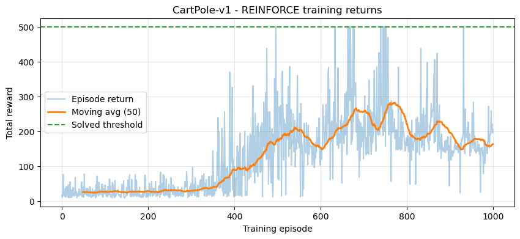
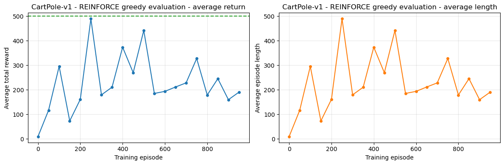
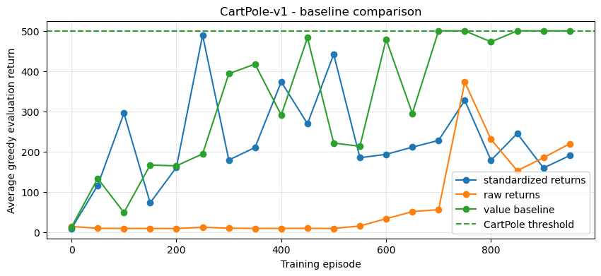
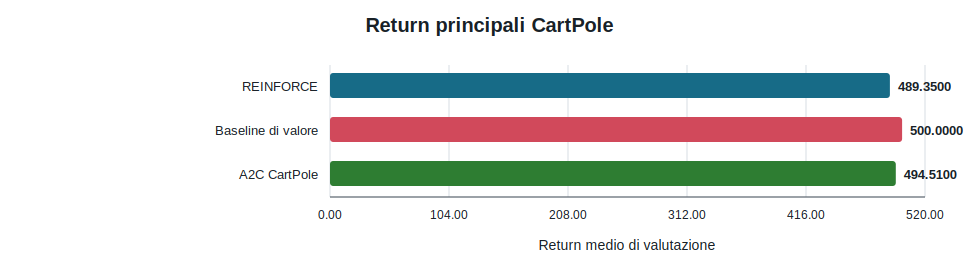
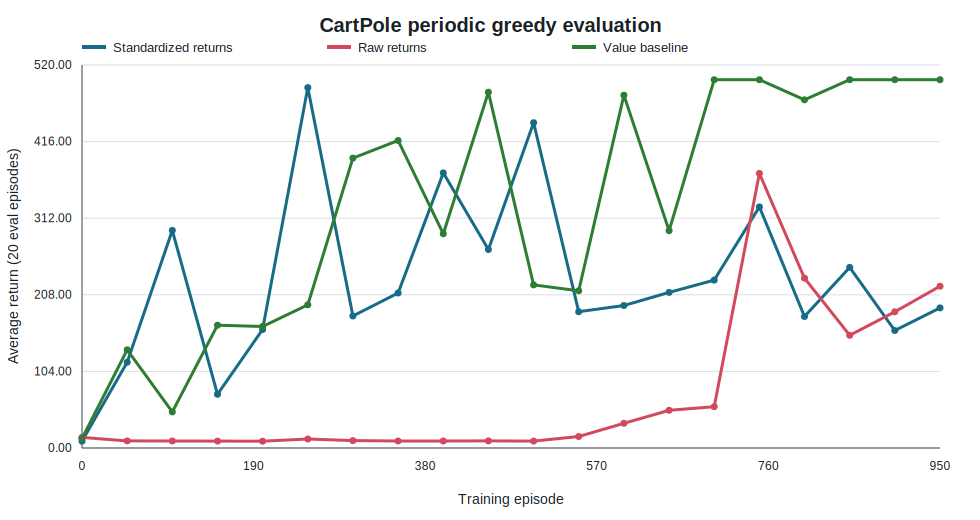
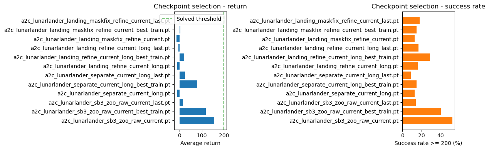
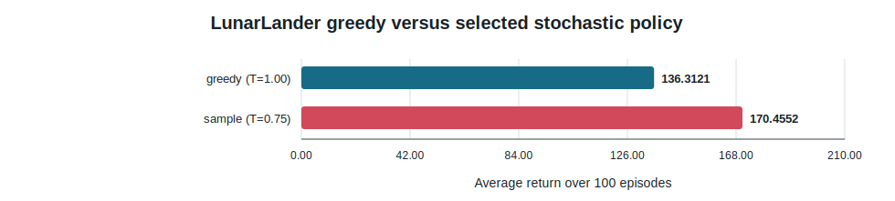
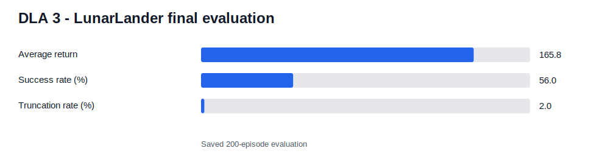
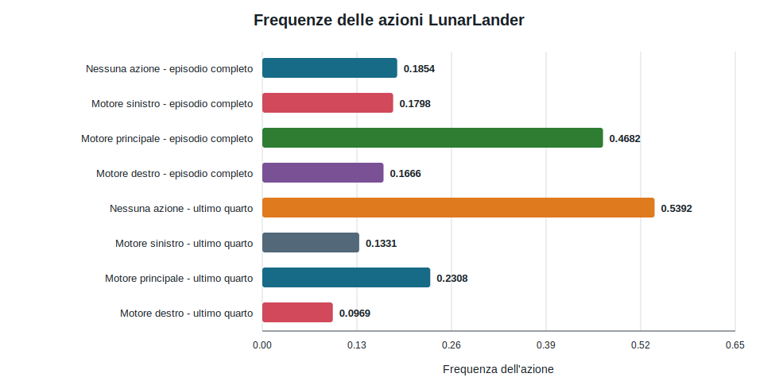

# DLA 3 — Policy Gradient e Advantage Actor-Critic

## Panoramica

Questo è l'unico laboratorio di Deep Reinforcement Learning del portfolio. Implementa REINFORCE su CartPole, lo estende con una value baseline appresa e sviluppa un'implementazione vettorizzata di Advantage Actor-Critic (A2C) per CartPole e LunarLander. Il principale cambiamento metodologico riguarda la valutazione: il return di training non è considerato evidenza sufficiente e le policy candidate vengono confrontate su episodi ripetuti con protocolli di valutazione fissi.

**Indice finale:** [`DLA_3.ipynb`](DLA_3.ipynb)

**Consegna ufficiale:** [`ASSIGNMENT.md`](ASSIGNMENT.md)

**Guida ai notebook:** [`notebooks/README.md`](notebooks/README.md)

## Obiettivi e copertura della consegna

| Requisito | Implementazione | Evidenza | Stato |
| --- | --- | --- | ---: |
| Esercizio 1: migliorare la valutazione REINFORCE | Valutazione greedy periodica su più episodi e selezione del checkpoint | [`01_cartpole_reinforce_evaluation.ipynb`](notebooks/01_cartpole_reinforce_evaluation.ipynb) | Completato |
| Esercizio 2: value baseline appresa | Rete del valore separata, advantage, value loss | [`02_cartpole_value_baseline.ipynb`](notebooks/02_cartpole_value_baseline.ipynb) | Completato |
| Esercizio 3.1: A2C | Aggiornamenti actor-critic e ambienti vettorizzati | [`03_a2c_cartpole_lunarlander.ipynb`](notebooks/03_a2c_cartpole_lunarlander.ipynb) | Completato |
| Esercizio 3.1: ambiente più difficile | Valutazione di checkpoint, modalità delle azioni e temperatura su LunarLander | Stesso notebook | Completato |

## Ambiente e definizione del problema

### CartPole-v1

CartPole espone quattro osservazioni continue: posizione/velocità del carrello e angolo/velocità angolare del palo. Lo spazio delle azioni contiene due scelte discrete che applicano una forza verso sinistra o destra. Ogni step non terminale restituisce `+1`; un episodio termina quando palo o carrello superano l'intervallo consentito oppure viene troncato a 500 step.

La soglia registrata da Gymnasium è un return medio di `475`. Questa implementazione usa `475` per il flag solved di A2C e una soglia periodica più severa di `500` nei confronti REINFORCE. Pertanto, “raggiunto 500” significa che la valutazione periodica su 20 episodi ha raggiunto la durata massima media, non una generica valutazione visuale.

### LunarLander-v3

LunarLander fornisce un'osservazione a otto dimensioni comprendente posizione, velocità, angolo, velocità angolare e indicatori di contatto delle gambe. Quattro azioni discrete selezionano nessun motore, motore laterale sinistro, motore principale o motore laterale destro. Il reward combina progresso, penalità del carburante, contatto delle gambe, atterraggio e schianto. Gli episodi terminano all'atterraggio o allo schianto e possono essere troncati dal limite temporale.

La relazione usa return `>= 200` come criterio di successo, coerentemente con la regola configurata. L'ambiente è più difficile perché la policy deve controllare traslazione, rotazione, carburante, contatto e comportamento terminale in presenza di campionamento stocastico delle azioni.

## REINFORCE

La policy è un MLP con due layer nascosti (`4 → 128 → 128 → 2`) seguito da una distribuzione categorica. Vengono campionate traiettorie complete. I return scontati sono calcolati all'indietro e, nella variante standard, standardizzati all'interno dell'episodio. L'obiettivo della policy è

\[
L_{policy} = -\sum_t \log \pi_\theta(a_t|s_t)\,G_t - \beta H(\pi_\theta(\cdot|s_t)).
\]

La media mobile originale dei return di training è utile per la visualizzazione, ma costituisce una regola di selezione debole: combina dati generati da policy in evoluzione ed è sensibile a episodi ad alta varianza. Il notebook rivisto valuta la policy corrente in modalità greedy ogni 50 episodi di training su 20 episodi nuovi e salva il miglior checkpoint di valutazione.

| Parametro | Valore REINFORCE |
| --- | ---: |
| Seed | 2112 |
| Fattore di sconto | 0.98 |
| Learning rate della policy | 3e-4 |
| Episodi di training | 1,000 |
| Intervallo di valutazione | 50 episodi |
| Episodi di valutazione | 20 |
| Coefficiente di entropia | 0.01 |
| Gradient clipping | 1.0 |
| Policy di selezione | Greedy |

### Training e valutazione periodica

I return di training sono rumorosi e non seguono in modo monotono la qualità della policy. È un comportamento atteso per uno stimatore Monte Carlo on-policy; la curva smussata è quindi descrittiva e non rappresenta il criterio di selezione del checkpoint.

La variante con return standardizzati ha raggiunto il miglior valore medio periodico di `489.35` all'episodio 250, ma ha terminato a `190.20`. Il crollo successivo al picco dimostra direttamente che una relazione basata soltanto sulla policy finale sarebbe fuorviante.

## Value baseline appresa

Una seconda rete stima \(V_\phi(s_t)\). La policy usa l'advantage sganciato dal gradiente

\[
A_t = G_t - V_\phi(s_t),
\]

mentre il critic minimizza l'errore quadratico medio tra valori predetti e return Monte Carlo. Sottrarre la baseline dipendente dallo stato non cambia il policy gradient atteso, ma può ridurne la varianza. Gli ottimizzatori di policy e valore sono separati.

| Parametro | Configurazione value baseline |
| --- | ---: |
| Learning rate della policy | 3e-4 |
| Learning rate del valore | 1e-3 |
| Fattore di sconto | 0.98 |
| Episodi di training | 1,000 |
| Frequenza / episodi di valutazione | 50 / 20 |
| Coefficiente di entropia | 0.01 |
| Gradient clipping | 1.0 |

### Confronto REINFORCE

| Metodo | Miglior return periodico | Return periodico finale | Prima valutazione a 500 |
| --- | ---: | ---: | ---: |
| Return standardizzati | 489.35 | 190.20 | Mai |
| Return grezzi | 372.85 | 219.70 | Mai |
| Value baseline appresa | **500.00** | **500.00** | Episodio 700 |

La baseline appresa è stata l'unica variante a raggiungere e mantenere la severa media periodica di 500 step. I return grezzi hanno appreso lentamente all'inizio e sono rimasti sotto il picco della variante standardizzata. Il risultato supporta la motivazione legata alla riduzione di varianza, pur riferendosi a un singolo seed di training e senza pretendere superiorità universale.

Le curve versionate in [`cartpole_evaluation.csv`](results/cartpole_evaluation.csv) espongono ogni punto di valutazione a intervalli di 50 episodi. La policy con value baseline diventa stabile nella fase avanzata del training; le altre varianti rimangono fortemente non monotone.

### Visualizzazione CartPole facoltativa su cinque episodi

La visualizzazione qualitativa usa `cartpole_reinforce_value_baseline.pt`, il modello finale adottato dall'esperimento REINFORCE direttamente confrontabile su 20 episodi. Il risultato A2C usa un protocollo differente a 100 episodi, quindi è riportato separatamente e non sostituisce questa selezione. Impostare `RUN_CARTPOLE_VISUALIZATION = True` in [`02_cartpole_value_baseline.ipynb`](notebooks/02_cartpole_value_baseline.ipynb) per generare localmente cinque animazioni `rgb_array` con azioni greedy.

| Episodio | Seed | Return | Lunghezza | Terminato | Troncato |
| ---: | ---: | ---: | ---: | ---: | ---: |
| 1 | 805471 | 500 | 500 | False | True |
| 2 | 233426 | 500 | 500 | False | True |
| 3 | 748088 | 500 | 500 | False | True |
| 4 | 994769 | 500 | 500 | False | True |
| 5 | 795806 | 500 | 500 | False | True |

I seed sono stati generati senza reinserimento dalla base `11112`; ogni rollout ha raggiunto il limite temporale di CartPole-v1. Un test headless ha raccolto 501 frame per episodio, ciascuno di forma `400 x 600 x 3`. L'evidenza leggera è [`cartpole_visual_episodes.json`](results/cartpole_visual_episodes.json); frame e video HTML da più megabyte sono intenzionalmente esclusi. Questi cinque rollout sono un controllo comportamentale, non una nuova valutazione statistica.

## Advantage Actor-Critic (A2C)

A2C aggiorna actor e critic da brevi rollout vettorizzati. Per ogni transizione, il target temporal-difference e l'advantage sono

\[
y_t = r_t + \gamma (1-d_t)V_\phi(s_{t+1}), \qquad
A_t = y_t - V_\phi(s_t).
\]

L'actor massimizza la log-probabilità dell'azione pesata per l'advantage sganciato più l'entropia; il critic minimizza l'errore sul valore. Gli ambienti vettorizzati raccolgono più traiettorie per aggiornamento. Le mask `terminated`/`truncated` corrette sono importanti: uno stato realmente terminale non deve eseguire bootstrap, mentre il raggiungimento del limite temporale viene tracciato separatamente.

### A2C su CartPole

| Parametro | Valore |
| --- | ---: |
| Fattore di sconto | 0.99 |
| Learning rate | 3e-4 |
| Lambda GAE | 0.95 |
| Coefficiente di entropia | 0.01 |
| Gradient clipping | 0.5 |
| Massimo numero di episodi di training | 800 |
| Frequenza / episodi di valutazione | 25 / 20 |
| Soglia operativa solved | 475 |

Il checkpoint A2C salvato è stato contrassegnato come solved durante il training. La valutazione greedy ha prodotto return medio `494.51` con deviazione standard `19.68`, confermando che l'implementazione actor-critic locale risolve l'ambiente di controllo più semplice.

### Configurazione A2C LunarLander

La baseline finale parte dal riferimento A2C di RL Baselines3 Zoo per LunarLander e lo adatta all'implementazione locale. Il riferimento esatto è [`hyperparams/a2c.yml`](https://github.com/DLR-RM/rl-baselines3-zoo/blob/master/hyperparams/a2c.yml), non un'implementazione copiata.

| Parametro | Valore derivato dal riferimento | Uso locale |
| --- | ---: | --- |
| Ambienti paralleli | 8 | Uguale per `sb3_zoo_raw_current` |
| Step totali | 200,000 nel riferimento | 300,000 per la baseline finale; gli altri raffinamenti denominati hanno budget espliciti |
| Step per rollout | 5 | Uguale |
| Fattore di sconto | 0.995 | Uguale |
| Learning rate | 8.3e-4 | Stesso valore iniziale, ridotto linearmente nella baseline finale |
| Coefficiente di entropia | 1e-5 | Uguale nella baseline finale |
| Lambda GAE | 1.0 | Uguale |
| Ottimizzatore | RMSprop | Uguale |
| Scala del reward | — | 1.0 nella baseline finale con reward grezzo |
| Episodi di valutazione durante la selezione | — | 100 |
| Episodi di valutazione finale | — | 200 |

Sono stati valutati ulteriori preset con actor/critic separati e raffinamento dell'atterraggio. Gli insuccessi non sono stati nascosti: diversi checkpoint hanno prodotto return medi negativi o bassi, mentre il checkpoint pulito in stile RL-Zoo è rimasto il candidato migliore. I suggerimenti dell'IA sono stati trattati come ipotesi; checkpoint e configurazione finali sono stati selezionati da valutazioni misurate.

## Selezione del checkpoint e della policy LunarLander

La pipeline di selezione ha tre fasi:

1. valutare le varianti di checkpoint disponibili su 100 episodi;
2. confrontare policy greedy e campionate su una griglia di temperature;
3. valutare checkpoint, modalità e temperatura selezionati su 200 episodi nuovi.

Il checkpoint `a2c_lunarlander_sb3_zoo_raw_current.pt` ha guidato il confronto iniziale con return medio `158.08`, deviazione standard `108.65` e success rate `54%`. Il notebook ha poi valutato configurazioni di selezione delle azioni per questo e altri checkpoint migliori.

Il confronto include varianti correnti e di raffinamento non riuscite. In questo modo le modalità di fallimento restano visibili invece di riportare soltanto il vincitore.

### Analisi della temperatura per il checkpoint selezionato

Le barre d'errore mostrano una deviazione standard su 100 episodi. Return medio e success rate non ordinano le temperature nello stesso modo: `T=0.45` ha il return medio più alto nel sottoinsieme (`179.65`), mentre `T=0.95` ha il maggior success rate (`61%`). Il notebook ha selezionato `T=0.75` tramite il punteggio di affidabilità, poiché combina return `170.46`, successo `59%` e nessun troncamento. Fonte: [`lunarlander_temperature_sweep.csv`](results/lunarlander_temperature_sweep.csv).

### Policy greedy rispetto a stocastica

Sullo stesso checkpoint selezionato, l'inferenza greedy ha ottenuto una media di `136.31`, successo `31%` e troncamento `2%`, mentre il campionamento con `T=0.75` ha ottenuto `170.46`, successo `59%` e nessun troncamento. La selezione stocastica delle azioni è stata quindi mantenuta per la valutazione finale. Fonte: [`lunarlander_policy_mode_comparison.csv`](results/lunarlander_policy_mode_comparison.csv).

## Valutazione finale LunarLander

| Metrica | Valore osservato |
| --- | ---: |
| Checkpoint | `a2c_lunarlander_sb3_zoo_raw_current.pt` |
| Policy | Campionata, temperatura 0.75 |
| Episodi di valutazione | 200 |
| Return medio | **165.76** |
| Deviazione standard del return | **100.56** |
| Return minimo / massimo | -168.77 / 294.88 |
| Lunghezza media dell'episodio | 487.83 |
| Criterio di successo | Return >= 200 |
| Success rate | **56.0%** |
| Terminati / troncati | 196 / 4 |
| Tasso di troncamento | 2.0% |

La panoramica normalizzata combina metriche con unità differenti soltanto per orientamento; i valori esatti sono nella tabella e in [`lunarlander_final_evaluation.json`](results/lunarlander_final_evaluation.json). La media resta sotto la soglia di successo configurata a 200 punti e la deviazione standard è ampia. La conclusione corretta non è quindi che LunarLander sia universalmente “risolto”, ma che questa policy abbia successo nel `56%` dei 200 episodi del protocollo fisso.

### Frequenze delle azioni

Negli episodi completi, il motore principale costituisce il `46.8%` delle azioni. Nell'ultimo quarto, il no-op sale al `53.9%`, mentre l'uso dei motori laterali diminuisce. Il comportamento è compatibile con una fase di inerzia/stabilizzazione al termine delle traiettorie riuscite, ma la sola frequenza delle azioni non dimostra la qualità dell'atterraggio.

Un controllo headless precedente è conservato su cinque seed riproducibili (da `100000` a `100004`), con azioni campionate a `T=0.85`. I return sono stati `234.61`, `189.29`, `7.06`, `201.54` e `174.26`; tutti gli episodi sono terminati normalmente e nessuno è stato troncato. Questo controllo qualitativo precede la scelta finale a `T=0.75` e non va confuso con la valutazione canonica su 200 episodi. Il codice è disattivato per impostazione predefinita tramite `RUN_LUNAR_VISUALIZATION = False`, mentre [`lunarlander_visual_episodes.json`](results/lunarlander_visual_episodes.json) conserva configurazione, seed, return, lunghezza, flag terminali, frequenze delle azioni e forma dei frame. Le animazioni sono disponibili localmente ma il loro payload HTML non è versionato.

## Cosa ha funzionato, cosa no e perché

**Ha funzionato:** la valutazione periodica ha esposto crolli della policy nascosti dalla media mobile; una value baseline appresa ha stabilizzato CartPole; A2C ha risolto CartPole secondo la soglia locale; brevi rollout vettorizzati hanno reso pratico il training di LunarLander; la selezione di checkpoint e temperatura ha migliorato l'affidabilità rispetto all'inferenza greedy.

**Ha funzionato meno:** REINFORCE standardizzato ha perso prestazioni dopo un picco iniziale; REINFORCE con return grezzi ha appreso lentamente; diversi checkpoint di raffinamento LunarLander hanno peggiorato la baseline pulita; l'inferenza greedy è stata inferiore al campionamento stocastico; la variabilità finale di LunarLander è rimasta elevata.

**Problemi risolti:** la valutazione è separata dal training; i checkpoint memorizzano metadati confrontabili; i vecchi percorsi assoluti non sono più usati nelle evidenze pubbliche; le statistiche di terminazione/troncamento sono esplicite; il training lungo è disattivato in modalità rapida; i requisiti Box2D/WSL sono documentati.

## Limiti

- Il training usa un solo seed principale e la selezione riutilizza un insieme finito di candidati.
- Il JSON finale su 200 episodi conserva statistiche aggregate, non ogni return; la deviazione standard è disponibile ma non è possibile ricostruire un istogramma completo.
- Selezione della temperatura e valutazione finale usano seed differenti, quindi è atteso che le medie differiscano.
- LunarLander non raggiunge un criterio di successo del 100% e presenta un'elevata varianza dei return.
- I checkpoint non sono versionati per ragioni di dimensione; output dei notebook e metriche leggere costituiscono l'evidenza pubblica.
- I risultati dipendono dalle versioni di Gymnasium/Box2D e non sono dichiarati deterministicamente identici bit per bit tra sistemi.

## Riproducibilità

Linux o WSL è consigliato. Installare le dipendenze dalla root, verificare `gymnasium.make("LunarLander-v3")` ed eseguire i notebook in ordine. In modalità rapida, tutti i flag relativi a training costosi, selezione, valutazione completa e rendering restano `False`; i notebook caricano le evidenze CSV/JSON versionate senza richiedere checkpoint. La modalità completa richiede di abilitare esplicitamente il flag pertinente e tempo sufficiente per centinaia di migliaia di step vettorizzati.

La configurazione centrale è [`config/lab3_defaults.yaml`](config/lab3_defaults.yaml). Le figure possono essere rigenerate senza training eseguendo `python tools/build_report_assets.py` dalla root.

## Struttura dei file

| Percorso | Scopo |
| --- | --- |
| `DLA_3.ipynb` | Indice del laboratorio leggibile su GitHub |
| `notebooks/01_*` | REINFORCE e valutazione rivista |
| `notebooks/02_*` | Confronto con value baseline |
| `notebooks/03_*` | Studio finale A2C CartPole/LunarLander |
| `exploratory/` | Prove A2C storiche, separate dai notebook finali |
| `src/dla_lab3/` | Moduli policy-gradient, A2C, valutazione, plotting e ambiente |
| `scripts/` | Utilità per ambiente e checkpoint |
| `config/lab3_defaults.yaml` | Impostazioni di ambiente, algoritmo, selezione ed esperimenti |
| `results/` | Metriche pubbliche leggere |
| `figures/` | Figure estratte o rigenerate dalle evidenze |

### Decisione sul notebook esplorativo

| File | Contenuto unico | Citato dalla relazione finale | Necessario per la consegna | Decisione |
| --- | ---: | ---: | ---: | --- |
| `exploratory/00_esperimenti_di_prova_a2c.ipynb` | Sì: prime prove con reti separate e raffinamenti | Solo come contesto storico | No | Conservato fuori da `notebooks/`; non fa parte dell'ordine finale di esecuzione |

## Dipendenze principali

| Libreria | Scopo | Utilizzata in |
| --- | --- | --- |
| PyTorch | Reti di policy/valore, autograd, ottimizzatori | REINFORCE e A2C |
| Gymnasium | Ambienti e interfacce vettoriali | CartPole e LunarLander |
| NumPy | Array dei rollout, statistiche, gestione dei seed | Training e valutazione |
| Matplotlib | Grafici di training/valutazione | Notebook eseguiti |
| Pygame | Rendering umano facoltativo | Episodi visuali |
| Box2D | Fisica LunarLander | A2C LunarLander |
| PyYAML / loader YAML locale | Configurazione degli esperimenti | Tutti i notebook |

## Moduli locali e funzioni principali

| Funzione/classe | File sorgente | Scopo | Input | Output | Utilizzata in |
| --- | --- | --- | --- | --- | --- |
| `PolicyNet` / `ValueNet` | [`policy_gradient.py`](src/dla_lab3/policy_gradient.py) | Modelli di policy e valore di stato per CartPole | Tensore di osservazione | Probabilità delle azioni / valore | Esercizi 1–2 |
| `reinforce` | [`policy_gradient.py`](src/dla_lab3/policy_gradient.py) | Addestra il policy gradient episodico con valutazione periodica | Policy, ambiente, configurazione | Cronologia e checkpoint | Esercizio 1 |
| `reinforce_with_value_baseline` | [`policy_gradient.py`](src/dla_lab3/policy_gradient.py) | Addestra congiuntamente policy e valore | Policy, rete del valore, ambiente, configurazione | Cronologia e checkpoint | Esercizio 2 |
| `ActorCritic` | [`a2c.py`](src/dla_lab3/a2c.py) | Rete actor-critic condivisa | Tensore di osservazione | Logit della policy e valore | Esercizio 3 |
| `train_a2c_vectorized` | [`a2c.py`](src/dla_lab3/a2c.py) | Addestra da brevi rollout paralleli | Factory di ambienti, rete, `A2CConfig` | Cronologia e checkpoint | Esercizio 3 |
| `evaluate_lunar_candidates` | [`experiments.py`](src/dla_lab3/experiments.py) | Confronta i checkpoint disponibili con un unico protocollo | Lista dei candidati, configurazione | Righe di valutazione | Selezione LunarLander |
| `evaluate_lunar_policy_configurations` | [`experiments.py`](src/dla_lab3/experiments.py) | Valuta modalità greedy/sample e temperature | Candidati selezionati, configurazione | Tabella dei risultati delle policy | Selezione LunarLander |
| `final_lunar_evaluation` | [`experiments.py`](src/dla_lab3/experiments.py) | Esegue il protocollo finale fisso su 200 episodi | Checkpoint, modalità, temperatura, configurazione | Metriche aggregate | Valutazione finale |
| `run_cartpole_visual_episodes` | [`visualization.py`](src/dla_lab3/visualization.py) | Renderizza cinque rollout CartPole riproducibili | Checkpoint, modalità delle azioni, seed base | Riepilogo leggero degli episodi | Esercizio 2 |
| `run_lunar_visual_episodes` | [`visualization.py`](src/dla_lab3/visualization.py) | Renderizza cinque rollout LunarLander riproducibili | Checkpoint e impostazioni della policy | Riepilogo leggero degli episodi | Notebook finale |

## Discussione degli iperparametri assistita dall'IA

ChatGPT e OpenAI Codex hanno supportato la revisione concettuale e il confronto delle impostazioni A2C. Il file RL Baselines3 Zoo è stato usato come riferimento esterno per `n_envs=8`, `gamma=0.995`, `n_steps=5`, learning rate `0.00083` e coefficiente di entropia `0.00001`. Questi valori sono stati adattati all'implementazione locale e al budget sperimentale; i suggerimenti dell'IA non sono stati accettati automaticamente e la policy finale è stata scelta da valutazioni misurate dei checkpoint e delle configurazioni. La dichiarazione completa è in [`../AI_USAGE.md`](../AI_USAGE.md).

## Fonti

- [Documentazione Gymnasium CartPole-v1](https://gymnasium.farama.org/environments/classic_control/cart_pole/)
- [Documentazione Gymnasium LunarLander-v3](https://gymnasium.farama.org/environments/box2d/lunar_lander/)
- [Documentazione PyTorch distributions](https://pytorch.org/docs/stable/distributions.html)
- [Documentazione Stable-Baselines3 A2C](https://stable-baselines3.readthedocs.io/en/master/modules/a2c.html)
- [Iperparametri A2C di RL Baselines3 Zoo](https://github.com/DLR-RM/rl-baselines3-zoo/blob/master/hyperparams/a2c.yml)
- [Sutton e Barto, Reinforcement Learning: An Introduction (MIT Press)](https://mitpress.mit.edu/9780262039246/reinforcement-learning/)

## Conclusione

Il risultato più importante del laboratorio non è un singolo return, ma un processo di valutazione più difendibile. La value baseline ha reso CartPole stabile secondo un criterio severo, mentre LunarLander ha richiesto selezione di checkpoint, modalità delle azioni e temperatura. La policy LunarLander finale ha ottenuto `165.76 ± 100.56` con successo nel `56%` dei 200 episodi: prestazioni utili ma ancora molto variabili, riportate senza affermare eccessivamente che l'ambiente sia risolto.
