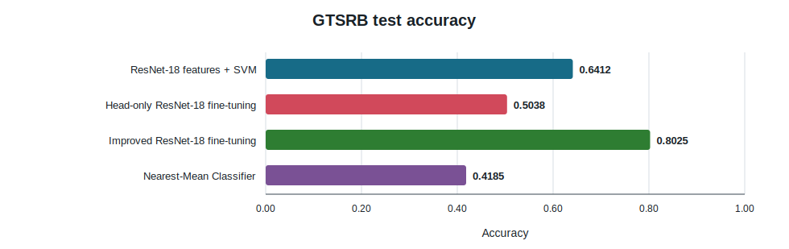
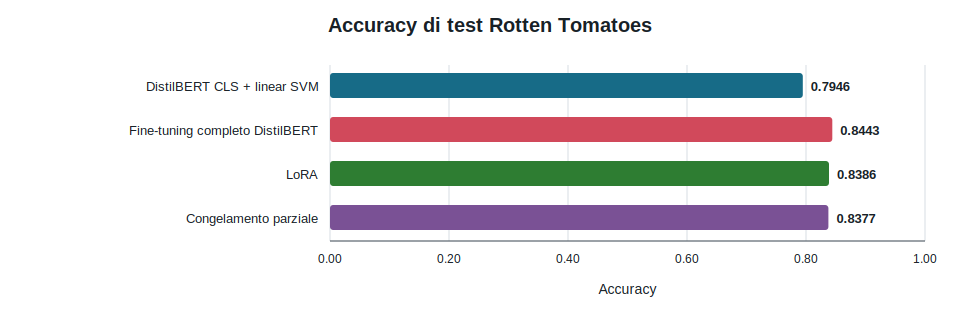
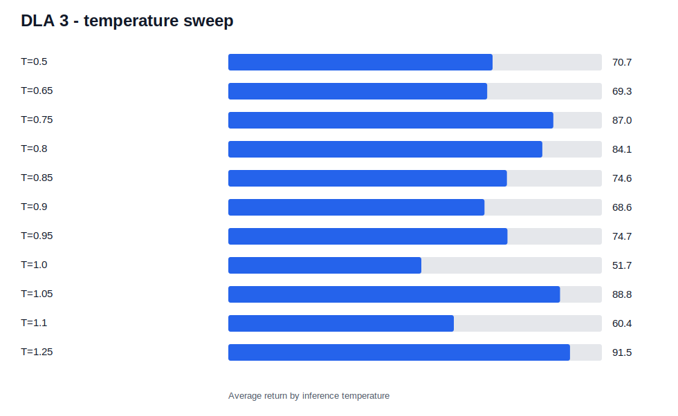

# Deep Learning Applications — Laboratory Portfolio

**Course:** Deep Learning Applications

**Author:** Francesco Faggioli

This repository contains the three laboratory assignments completed for the course. The portfolio follows a progression from transfer learning in computer vision, through Transformer adaptation and multimodal models, to policy-gradient methods. The laboratories are separate studies: **only DLA 3 concerns Deep Reinforcement Learning** and their metrics must not be compared as if they belonged to one task.

The main objective of this final version is auditability. Executed notebook outputs remain visible, headline metrics are mirrored in lightweight `results/` files, and every report distinguishes observed evidence from interpretation.

## Repository at a glance

| Laboratory | Topic | Main exercises | Main methods | Final notebook | Detailed report |
| --- | --- | --- | --- | --- | --- |
| DLA 1 | GTSRB traffic-sign recognition | EDA, stable baseline, fine-tuning, reusable pipeline, retrieval | Pretrained ResNet features, SVM, selective fine-tuning, cosine retrieval, NMC | [`DLA_1.ipynb`](DLA_1/DLA_1.ipynb) | [`DLA_1/README.md`](DLA_1/README.md) |
| DLA 2 | Transformers and vision-language adaptation | Sentiment baseline, full and efficient fine-tuning, CLIP adaptation | DistilBERT, linear SVM, Hugging Face Trainer, LoRA, partial freezing, CLIP-Adapter | [`DLA_2.ipynb`](DLA_2/DLA_2.ipynb) | [`DLA_2/README.md`](DLA_2/README.md) |
| DLA 3 | Deep Reinforcement Learning | REINFORCE evaluation, value baseline, A2C on two environments | Monte Carlo policy gradient, learned baseline, vectorized A2C, policy-temperature selection | [`DLA_3.ipynb`](DLA_3/DLA_3.ipynb) | [`DLA_3/README.md`](DLA_3/README.md) |

The official exercise texts are available as [`DLA_1/ASSIGNMENT.md`](DLA_1/ASSIGNMENT.md), [`DLA_2/ASSIGNMENT.md`](DLA_2/ASSIGNMENT.md), and [`DLA_3/ASSIGNMENT.md`](DLA_3/ASSIGNMENT.md).

## Overall workflow

**DLA 1** starts from a fixed pretrained representation. ResNet-18 features provide a stable SVM baseline before the study moves to supervised fine-tuning, configuration-driven experiments, class imbalance, augmentation, experiment tracking, and training-free retrieval.

**DLA 2** transfers the same idea to language and multimodal data. Frozen DistilBERT embeddings establish a baseline; full fine-tuning is then compared with LoRA and partial freezing. A separate ImageNet-Sketch experiment evaluates CLIP under domain shift and adapts only a small MLP.

**DLA 3** changes learning paradigm. It begins with episodic REINFORCE, adds a value baseline to reduce gradient variance, and then implements actor-critic updates with vectorized environments. CartPole validates the implementation; LunarLander exposes the instability and evaluation demands of the harder control problem.

## Main outcomes

| Lab | Experiment | Metric | Result | Evidence |
| --- | --- | ---: | ---: | --- |
| DLA 1 | ResNet-18 features + SVM | GTSRB test accuracy | 0.6412 | [`test_metrics.csv`](DLA_1/results/test_metrics.csv), executed baseline notebook |
| DLA 1 | Improved selective fine-tuning | GTSRB test accuracy | 0.8025 | [`test_metrics.csv`](DLA_1/results/test_metrics.csv), executed improvement notebook |
| DLA 1 | Cosine retrieval | Precision@1 | 0.4812 | [`test_metrics.csv`](DLA_1/results/test_metrics.csv), executed retrieval notebook |
| DLA 2 | Full DistilBERT fine-tuning | Rotten Tomatoes test accuracy | 0.8443 | [`sentiment_results.csv`](DLA_2/results/sentiment_results.csv) |
| DLA 2 | LoRA | Test accuracy / trainable share | 0.8386 / 1.09% | [`sentiment_results.csv`](DLA_2/results/sentiment_results.csv) |
| DLA 2 | CLIP-Adapter, bottleneck 128 | ImageNet-Sketch accuracy | 0.5241 | [`clip_results.csv`](DLA_2/results/clip_results.csv) |
| DLA 3 | REINFORCE with value baseline | CartPole final periodic return | 500.0 | [`method_summary.csv`](DLA_3/results/method_summary.csv) |
| DLA 3 | A2C, sampled policy at T=0.75 | LunarLander average return / success rate | 165.76 / 56.0% | [`lunarlander_final_evaluation.json`](DLA_3/results/lunarlander_final_evaluation.json) |

These rows summarize executed outputs; they are not newly computed benchmark claims. In DLA 1, the `0.8025` test result is tied to the notebook's fixed final evaluation, while the separately exported validation histories describe named development runs. DLA 2 accuracy values belong to two different tasks and datasets. DLA 3 reports both central tendency and variability in its detailed report.

## Visual overview

### DLA 1 — GTSRB classification



Selective fine-tuning produced the strongest final test result. The head-only baseline underperformed the fixed-feature SVM, showing that replacing and training only the classifier head was not sufficient for this domain shift. Source: [`DLA_1/results/test_metrics.csv`](DLA_1/results/test_metrics.csv).

### DLA 2 — sentiment adaptation



Full fine-tuning achieved the highest test accuracy, but LoRA retained most of it while optimizing approximately 1.09% of the model parameters. Source: [`DLA_2/results/sentiment_results.csv`](DLA_2/results/sentiment_results.csv).

### DLA 3 — LunarLander evaluation



The large standard deviations show why a single rollout or training return was not used for model selection. Temperature `0.75` was selected through a reliability score, not because it maximized mean return alone. Source: [`DLA_3/results/lunarlander_temperature_sweep.csv`](DLA_3/results/lunarlander_temperature_sweep.csv).

## Repository structure

```text
DLA_Lab/
├── README.md
├── AI_USAGE.md
├── CODE_OF_CONDUCT.md
├── requirements.txt
├── environment.yml
├── pyproject.toml
├── tools/
│   └── build_report_assets.py
├── DLA_1/
│   ├── DLA_1.ipynb
│   ├── ASSIGNMENT.md
│   ├── README.md
│   ├── config/  figures/  results/
│   ├── notebooks/  scripts/  src/
│   └── exploratory/
├── DLA_2/
│   ├── DLA_2.ipynb
│   ├── ASSIGNMENT.md
│   ├── README.md
│   └── config/  figures/  results/  notebooks/  scripts/  src/
└── DLA_3/
    ├── DLA_3.ipynb
    ├── ASSIGNMENT.md
    ├── README.md
    ├── config/  figures/  results/
    ├── notebooks/  scripts/  src/
    └── exploratory/
```

Datasets, model checkpoints, W&B runs, Hugging Face output directories, caches, and full local artifacts are deliberately omitted from this tree and from Git.

## How to inspect the submission

1. Read this overview, then open the detailed README for each laboratory.
2. Open the three main index notebooks: [`DLA_1.ipynb`](DLA_1/DLA_1.ipynb), [`DLA_2.ipynb`](DLA_2/DLA_2.ipynb), and [`DLA_3.ipynb`](DLA_3/DLA_3.ipynb).
3. Use each `notebooks/README.md` to follow the detailed notebooks in exercise order.
4. Inspect the preserved outputs in those notebooks and the lightweight evidence in each `results/` directory.
5. Treat `exploratory/` as historical context only; it is not part of the final execution path.

Long training, feature extraction, final test reevaluation, W&B logging, and LunarLander runs are disabled by default where a `RUN_*` or `ENABLE_WANDB` flag is exposed. Existing outputs are retained for review; enabling a flag is an explicit request to recompute an experiment.

## Installation and execution

`requirements.txt` is the canonical cross-platform dependency list. `environment.yml` creates a Conda environment and delegates package installation to that file. `pyproject.toml` contains formatter/linter configuration only and is not a third environment specification.

### Windows PowerShell

```powershell
py -3.12 -m venv .venv
.\.venv\Scripts\Activate.ps1
python -m pip install --upgrade pip
python -m pip install -r requirements.txt
python -m jupyter lab
```

### Linux or WSL

```bash
python3.12 -m venv .venv
source .venv/bin/activate
python -m pip install --upgrade pip
python -m pip install -r requirements.txt
python -m jupyter lab
```

Alternatively:

```bash
conda env create -f environment.yml
conda activate DLA2026
python -m jupyter lab
```

Linux/WSL is recommended for DLA 3 because the Box2D and rendering dependencies required by LunarLander are more reliable there. CUDA is optional; CPU execution is supported but full feature extraction and training are substantially slower.

## Reproducibility and artifacts

- Global seeds are `42` for DLA 1 and DLA 2, and `2112` for DLA 3. Environment and evaluation seeds are derived deterministically in the implementation.
- Dataset downloads are not versioned. The reports record the exact split sizes observed in the executed notebooks.
- Checkpoints (`*.pt`, `*.safetensors`, Hugging Face checkpoint folders) remain local because of size.
- Lightweight final metrics, histories, and plotting inputs are versioned under `results/`.
- [`tools/build_report_assets.py`](tools/build_report_assets.py) regenerates report SVGs and extracts selected PNG outputs from the versioned notebooks without rerunning training.
- Quick inspection uses saved notebook outputs and `results/`; full execution requires datasets, model downloads, optional W&B credentials, and explicit training flags.
- The repository does not claim bitwise reproducibility across CUDA, driver, PyTorch, or Gymnasium versions. Stochastic RL evaluation is reported over multiple episodes for this reason.

## AI use and academic integrity

ChatGPT and OpenAI Codex supported conceptual clarification, debugging, code organization, documentation, and consistency checks. The author executed and reviewed the experiments; AI output was not accepted as experimental evidence. Full disclosure is in [`AI_USAGE.md`](AI_USAGE.md). Expected conduct and authorship responsibility are stated in [`CODE_OF_CONDUCT.md`](CODE_OF_CONDUCT.md).

## References

- [PyTorch documentation](https://pytorch.org/docs/stable/index.html)
- [Torchvision documentation](https://pytorch.org/vision/stable/index.html)
- [Hugging Face documentation](https://huggingface.co/docs)
- [Gymnasium documentation](https://gymnasium.farama.org/)
- [Weights & Biases documentation](https://docs.wandb.ai/)

Laboratory-specific datasets, papers, APIs, and implementation references are listed in the corresponding detailed reports.
